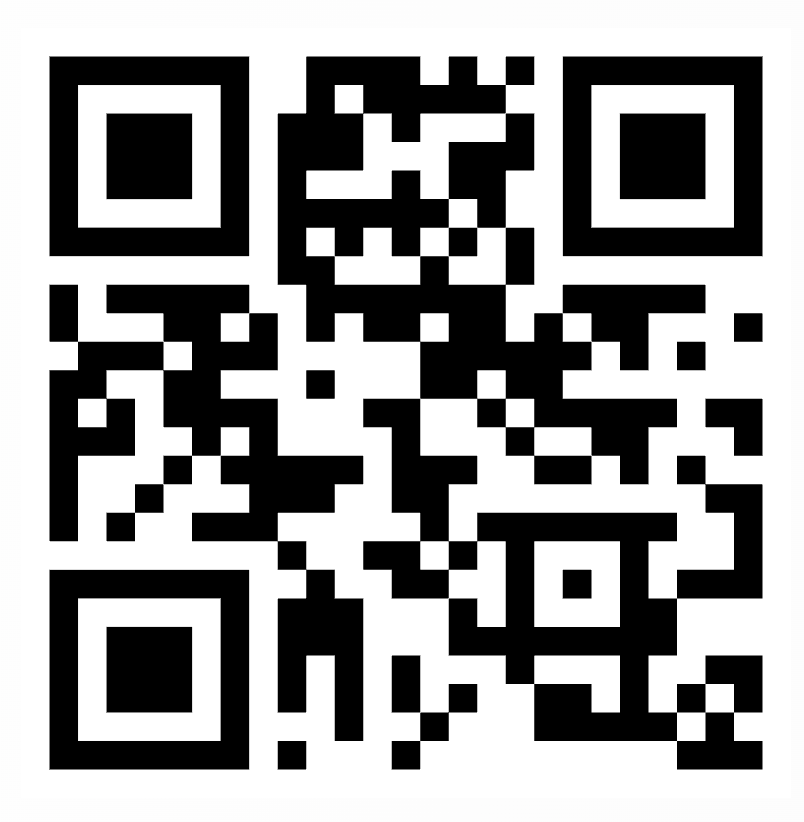

## 📋 ONE-TIME SETUP (Do Once)

Complete steps 1-4 once before your first ski day

### Step 1: Download Sensor Logger

Download the Sensor Logger app from your phone's app store:
- [www.tszheichoi.com/sensorlogger](https://www.tszheichoi.com/sensorlogger)

### Step 2: Join the Study

Open Sensor Logger and go to the **Studies** tab. Tap the **'Create/Join'** button, then select **'Join a Study'**.

### Step 3: Enter Study Code

Enter the study code when prompted:

```
3d3443e5
```

### Step 4: Complete the Questionnaire

Fill out the brief questionnaire with your personal information:
- Name
- Email
- Weight (in kg)
- Height (in cm)

---

## 🎿 EACH SKI DAY (Repeat Every Time)

Complete steps 5-8 each time you go skiing

### Step 5: Start Recording

In the Sensor Logger app, go to the **Logger** tab and tap **'Start Recording'**.

### Step 6: Go Skiing

Place your phone in a **chest pocket** and **go enjoy your ski day!**

### Step 7: Stop Recording & Upload

When finished, tap **'Stop Recording'**. Confirm the recording and upload when you have a wifi connection.

### Step 8: Review Your Results

Visit your personalized webpage to review your skiing performance analysis. A link will be provided after upload.

---

## 💡 Important Tips

- **Fully charge your phone** before recording to ensure you have enough battery for the entire ski session
- **Cell service is not necessary** – the app works completely offline and will save all sensor data locally
- **Upload on wifi** – recording files are large, so upload on a wifi connection when you're back at the lodge or home
- **Only works on iPhones** - more devices will be supported soon 


